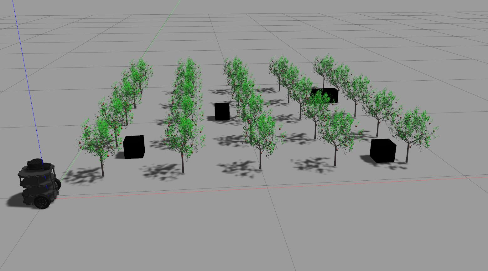

# KSAM-2022-Robotic-Competition

## Introduction
**로봇 미션:** 제작한 로봇을 이용하여 과수원 모사 경기장 내의 출발점부터 도착점까지 주행하면서 과수 모형에 달린 과일을 검출, 분류, 계수함(로봇 임무 제한시간은 5분 이내) <br /> <br />
**주행:** 과수 열을 인식하여 열 사이로 충돌없이 주행해야 함 <br />
      &emsp; - 각 팀별로 주어지는 예비 시험에서 맵작성 가능 <br />
      &emsp; - 주행시간은 로봇의 출발점부터 주행하면서 각 과수의 과일 검출을 끝내고 도착점까지 이동한 시간으로 측정함 <br /> <br />
**회피:** 주행 동안 주어진 장애물 모형을 충돌 없이 회피하여야 함 <br />
      &emsp; - 장애물은 본선대회 당일 임의 재배치 됨 <br /> <br />
**검출:** 과수 모형에 달린 과일을 정상과와 질병과로 분류하고 계수해야 함



## Requirements
```
sudo apt-get install ros-noetic-slam-karto
sudo apt-get install ros-noetic-teb-local-planner
```

## Instalation
To install this repository on your home folder:
```
cd ~
git clone git@github.com:mefisto2017/KSAM-2022-Robotic-Competition.git
cd KSAM-2022-Robotic-Competition/ros
catkin_make
```
Before running the repository the models path needs to be setup:
```
echo 'export GAZEBO_MODEL_PATH=~/KSAM-2022-Robotic-Competition/ros/src/robot_gazebo/models:${GAZEBO_MODEL_PATH}' >> ~/.bashrc
source ~/.bashrc
```

## Run Simulation

### Gazebo
```
source ./devel/setup.bash
roslaunch robot_gazebo scenario_1_world.launch
```

### Karto SLAM
In another terminal:
```
cd ~/KSAM-2022-Robotic-Competition/ros
source ./devel/setup.bash
roslaunch robot_slam robot_slam.launch sim_real:='simulation'
```

### Navigation
In another terminal:
```
cd ~/KSAM-2022-Robotic-Competition/ros
source ./devel/setup.bash
```
DWA planner:
```
roslaunch turtlebot3_navigation turtlebot3_navigation.launch sim_real:='simulation' planner:=dwa
```
TEB planner:
```
roslaunch turtlebot3_navigation turtlebot3_navigation.launch sim_real:='simulation' planner:=teb
```


## Run Real Robot

### Bring Up
```
cd ~/KSAM-2022-Robotic-Competition/ros
source ./devel/setup.bash
roslaunch turtlebot_bringup turtlebot_robot
```

### Karto SLAM
In another terminal:
```
cd ~/KSAM-2022-Robotic-Competition/ros
source ./devel/setup.bash
roslaunch robot_slam robot_slam.launch sim_real:='real'
```

### Navigation
In another terminal:
```
cd ~/KSAM-2022-Robotic-Competition/ros
source ./devel/setup.bash
```
DWA planner:
```
roslaunch turtlebot3_navigation turtlebot3_navigation.launch sim_real:='simulation' planner:=dwa
```
TEB planner:
```
roslaunch turtlebot3_navigation turtlebot3_navigation.launch sim_real:='simulation' planner:=teb
```


## Common Scripts

### Teleoperation
In another terminal:
```
cd ~/KSAM-2022-Robotic-Competition/ros
source ./devel/setup.bash
roslaunch turtlebot3_teleop turtlebot3_teleop_key.launch
```

To initiate the waypoints:
```
cd ~/KSAM-2022-Robotic-Competition/ros
source ./devel/setup.bash
rosrun turtlebot3_navigation goals.py
```

To reset the robot position:

```
cd ~/KSAM-2022-Robotic-Competition/ros
source ./devel/setup.bash
rosrun turtlebot3_navigation reset.py
```


## TODO
- [ ] DWA https://github.com/mefisto2017/KSAM-2022-Robotic-Competition/issues/1
- [ ] Karto SLAM https://github.com/mefisto2017/KSAM-2022-Robotic-Competition/issues/3
- [ ] Real Robot https://github.com/mefisto2017/KSAM-2022-Robotic-Competition/issues/7
- [ ] Fruit Detection
- [ ] Fruit Counting

## Dection 'have to do'


